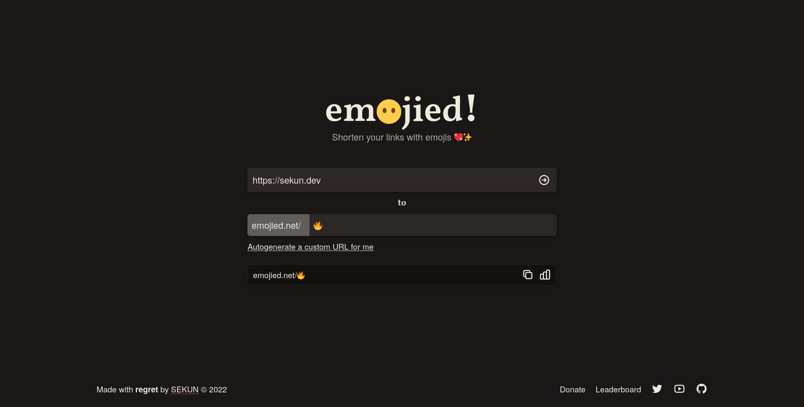

# emojied


<p align="center">
  
</p>

Shorten your URLs with emojis!

## Features

- Well, shorten your URLs!
- Customize what emoji to use. e.g Want to use an eggplant emoji? Sure, as long
  as it's not taken!
- Not sure what emoji to use? `emojied` autogenerates one for you.
- View URL clicks (simple stats for now)
- Leaderboard - See the top 20 most clicked links!
- Do you hate enabling JS? Well, this works completely fine with JS disabled!\*

## Getting Started

### Build from source

You can build the binary, and static assets with `nix`. You can also build it
some other way if you prefer, but I'm not gonna bother with that.

Options:

1. `nix build`: Builds `emojied`'s static binary + static assets, and provides
an `APP__STATIC_ASSETS` environment variable. This is the "wrapped" version.
2. `nix build .#emojied-unwrapped`: Like above, but doesn't provide the env
variable.

In both, everything is already taken care of. \#1 is more suitable for distributing
it as an application, while \#2 makes more sense when you want to simply copy
the output to a VPS.

### Environment variables

`emojied` requires you to provide some environment variables, namely the ff:

- `APP_STATIC_ASSETS` (required, path that directly contains `app.css`, etc.):
Path of `public/`
- `PG__HOST` (required)
- `PG__DBNAME` (required)
- `PG__USER` (required)
- `PG__PASSWORD` (required)
- `PG__PORT` (required)
- `PG__POOL_SIZE` (optional, defaults to `22`)
- `PG__CA_CERT` (optional, defaults to No TLS): CA certificate's file path
- `CA_CERT` (optional): CA certificate's contents. This shouldn't contain the
`BEGIN` and `END` certificate headers. See `bin/run`.

### Build a `Docker` image

If ever you need a Docker image with `emojied`, then you'll need `nix` (flakes)
to build it.

```sh
# Build the Docker image tar
nix build .#emojied-docker

# Load result to Docker
docker load < result
```

From this, you get a Docker image `emojied-docker:latest`! If you want an example,
you can check out the `.github/workflows/main.yml`.

## Concepts I have to study in more depth

- Traits: Besides the similarities this shares with Haskell's typeclasses, there
  are a lot of things about it that I don't know.
- async
- futures
- tokio
- streams

\* If you're using an extension to disable JS, then this will depend on if they
copied the noscript tag attributes cause the ones I've used don't. It's a bug.
